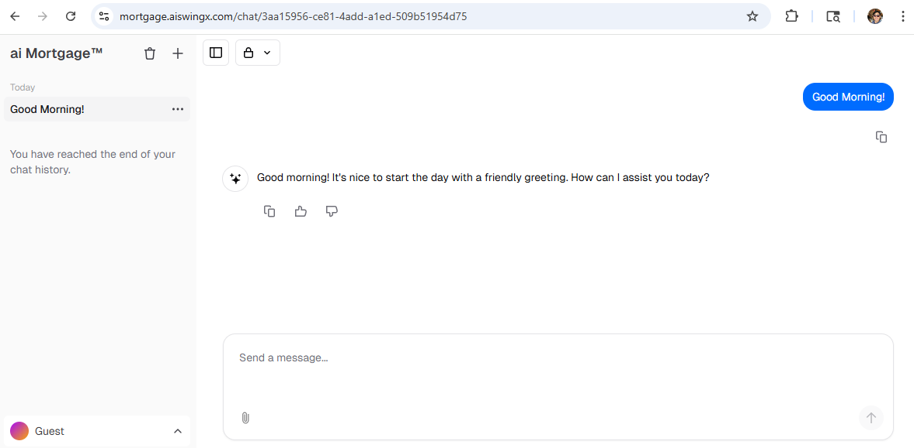
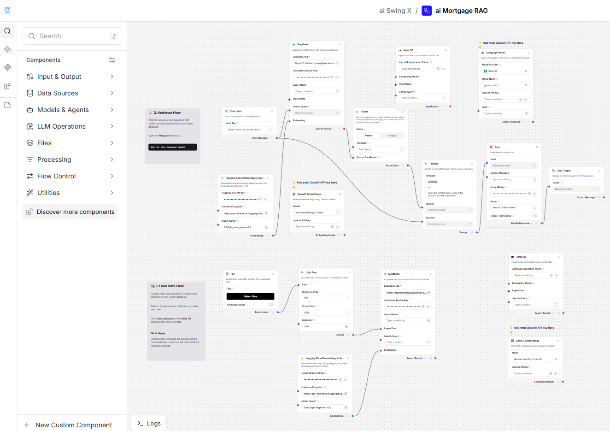

# 🏦 High-Performance Mortgage AI Agent  
### Zero-Lag Inference | Agentic Workflow | Production-Ready

Building a **High-Performance Mortgage AI Agent** with near zero-lag inference 🚀  

This AI-powered Mortgage Agent is designed to deliver **instant, precise financial consultations** by combining a robust **RAG (Retrieval-Augmented Generation)** pipeline with specialized **agentic tools**.

This system doesn’t just *chat* — it **calculates, retrieves, and researches in real time**.

---

## 🎯 Project Overview

The Mortgage AI Agent provides:

- 📊 Accurate mortgage payment calculations  
- 📚 Instant retrieval of mortgage guidelines (LTV, DTI, regulations)  
- 🌐 Real-time market rate research  
- ⚡ Ultra-fast LLM responses with minimal infrastructure

  

All optimized to run efficiently on a **lightweight server environment**.

---

## 🏗️ Tech Stack

| Layer | Technology | Purpose |
|-------|------------|----------|
| Orchestration | **Langflow** | AI workflow backbone |
| LLM Engine | **Groq (Llama 3.1)** | Ultra-fast inference ⚡ |
| Vector DB | **Supabase (pgvector)** | Mortgage knowledge base 📚 |
| Frontend | **Vercel** | Seamless, responsive deployment |
| Infrastructure | 1 vCPU / 1GB RAM / 25GB NVMe | Lightweight & efficient |

---

## 🤖 Core Features

### 🔎 Smart RAG Pipeline
- Vectorized mortgage regulations
- Context-aware retrieval
- Structured knowledge grounding
- Reduced hallucination risk through domain-specific data injection

### 🧮 Agentic Tools
- **Mortgage Calculator Tool**
  - Deterministic monthly payment estimation
  - Principal / Interest breakdown
  - Interest rate sensitivity analysis
- **URL Fetcher Tool**
  - Real-time mortgage rate lookup
  - Live market condition analysis
  - Dynamic data grounding

### ⚡ High-Speed Performance
- Powered by **Groq’s ultra-low latency inference**
- Tool-based deterministic computation instead of LLM-only reasoning
- Optimized for minimal compute environments
- Production-ready design on lightweight infrastructure

---

## 🧠 Architecture Overview

The Mortgage AI Agent follows a modular, agentic architecture optimized for **speed, accuracy, and efficiency**.

### 🔄 End-to-End Flow

1. **User Query**
   - User submits a mortgage-related question (calculation, regulation, or market inquiry).

2. **Langflow Orchestration Layer**
   - Classifies user intent.
   - Dynamically routes requests to:
     - RAG retrieval
     - Agent tools
     - Direct LLM reasoning

3. **RAG Retrieval (Supabase + pgvector)**
   - Searches vectorized mortgage knowledge.
   - Retrieves relevant regulatory context:
     - LTV limits
     - DTI thresholds
     - Compliance guidelines
   - Injects grounded context into the prompt.

4. **Agentic Tool Execution (If Required)**
   - 🧮 Mortgage Calculator Tool executes deterministic math.
   - 🌐 URL Fetcher retrieves live rate data.

5. **Groq LLM (Llama 3.1)**
   - Ultra-low latency inference.
   - Combines:
     - Retrieved knowledge
     - Tool outputs
     - User intent
   - Produces structured, financial-grade responses.

6. **Frontend Delivery (Vercel)**
   - Clean UI rendering
   - Fast edge deployment
   - Responsive user interaction

---

### 📊 Logical Flow Diagram

**User Request**
↓  
**Langflow (Orchestrator)**
- Intent classification
- Dynamic routing (RAG / Tools / LLM)

↓  
**RAG Retrieval (Supabase + pgvector)**
- Vector search on mortgage knowledge base
- Inject regulatory context (LTV, DTI, compliance)

↓  
**Agent Tools (If Required)**
- Mortgage Calculator (deterministic math)
- URL Fetcher (real-time rate lookup)

↓  
**Groq Llama 3.1 (LLM Inference)**
- Combines:
  - Retrieved knowledge
  - Tool outputs
  - User intent
- Generates structured financial response

↓  
**Vercel Frontend**
- Clean UI rendering
- Fast edge delivery

